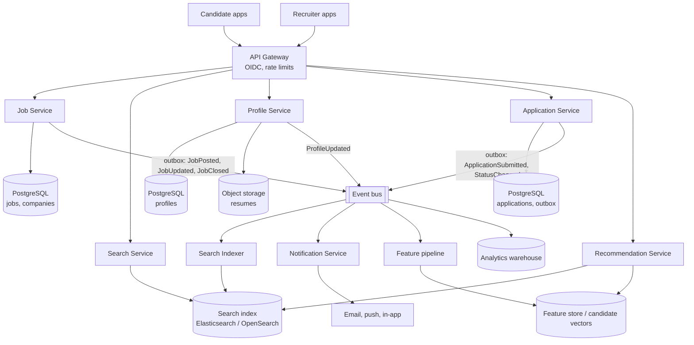
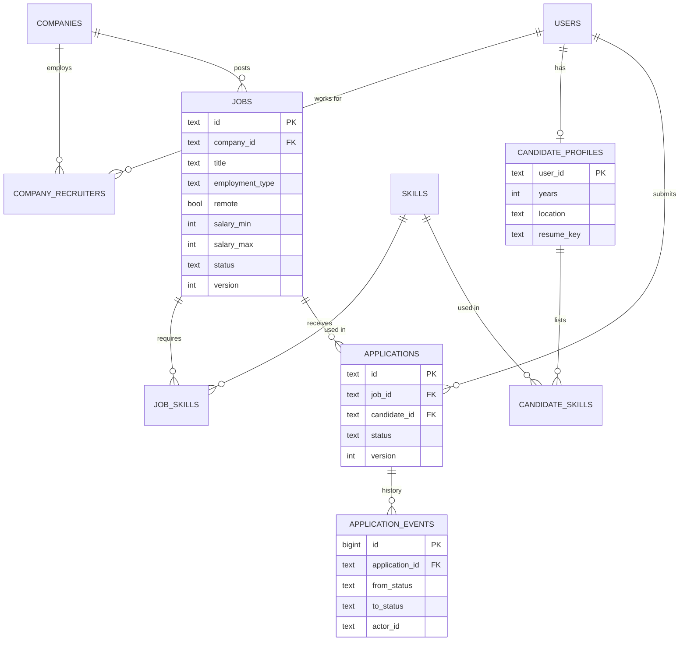
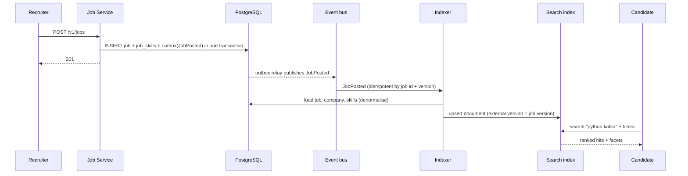
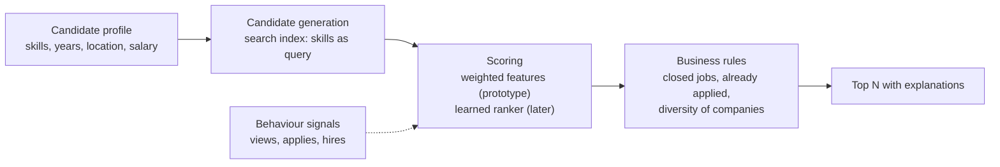

# Job Portal — Reference System Design

> Reference system design inspired by publicly known product requirements of job portals. It does not describe any
> company's internal architecture. Numbers are illustrative assumptions.

**Author:** Shiv Kumar · [GitHub](https://github.com/shivkumarsinghsky)

## Requirements

A marketplace connecting **candidates** and **recruiters** of **companies**. Candidates search jobs, keep a profile
and resume, get recommendations and apply; recruiters post jobs, review ranked applicants and move them through a
hiring pipeline. Both sides are notified as things change. The hard parts are **search relevance with structured
filters**, **matching/recommendations**, **a correct application workflow** and **keeping the search index in sync**
with the source of truth.

## Functional Requirements

| Area | Requirement |
|---|---|
| Companies & recruiters | A company has recruiters with roles (admin, recruiter); only they manage its jobs and applicants |
| Jobs | Post, update, close; title, description, location, remote, employment type, skills (required/nice), experience, salary range |
| Search | Full-text query with filters (location, remote, type, salary, experience), facets, pagination, relevance ranking |
| Candidates | Profile with skills, experience, location, remote preference, desired salary; resume upload |
| Recommendations | Jobs for a candidate; ranked applicants for a recruiter, with explanations (missing skills) |
| Applications | One per candidate per job; pipeline applied → screening → interview → offer → hired / rejected; candidate may withdraw |
| Notifications | In-app and email on new application, status changes, withdrawals; saved-search alerts |
| Analytics | Funnel (views → applies → hires), time-to-hire, source effectiveness |

Out of scope: payments for job promotion, assessments, interview scheduling, background checks.

## Non-Functional Requirements

| Concern | Target |
|---|---|
| Search latency | p95 < 300 ms including filters and facets |
| Index freshness | New/closed jobs searchable within ~10 s |
| Application correctness | Exactly one application per candidate and job, even under retries and double clicks |
| Availability | Search and job pages 99.9%; application submission 99.95% |
| Privacy | Resumes and contact details visible only to the candidate and recruiters of companies they applied to |
| Compliance | Data export and deletion on request; retention limits for applications |

## Capacity Estimation

From the capacity model in
[system-design-architecture](https://github.com/shivkumarsinghsky/system-design-architecture) (`python -m capacity
job-portal`): 5M daily active users, ~15 reads (searches, job views) and ~0.3 writes (applications, profile edits,
saved searches) per user per day, peak factor 3×.

| Metric | Estimate |
|---|---|
| Read QPS (avg / peak) | ~870/s / ~2.6K/s |
| Write QPS (avg / peak) | ~17/s / ~52/s |
| Read:write ratio | 50:1 |
| Structured data | ~7.5 GB/day before replication; resumes (~200 KB each) in object storage |

The system is read- and search-heavy; writes are low volume but must be correct. That shapes the design: a
relational source of truth, a separate search index fed by events, and caches in front of read paths.

## High-Level Architecture



| Component | Responsibility | Store |
|---|---|---|
| Job Service | Companies, recruiters, job lifecycle; authorization of recruiters | PostgreSQL |
| Profile Service | Candidate profiles, skills, resume upload (pre-signed URLs), resume parsing trigger | PostgreSQL + object storage |
| Application Service | Applications, pipeline state machine, idempotency, status history, outbox | PostgreSQL |
| Search Indexer | Consumes job events, builds denormalised search documents | Search index |
| Search Service | Query parsing, relevance, filters, facets, pagination | Search index |
| Recommendation Service | Candidate generation from the index + scoring/ranking | Index + feature store |
| Notification Service | Fan-out of events to channels, preferences, idempotency | Own store |

The prototype in `src/jobs/` implements these responsibilities as in-process modules (see the README).

## API Design

```http
POST /v1/companies                                  {name}                                   → 201
POST /v1/jobs                                       {companyId, title, description, ...}     → 201
POST /v1/jobs/{jobId}/close
GET  /v1/jobs/search?q=python+kafka&location=Berlin&remote=true&employment_type=full_time
                    &min_salary=80000&max_years=5&page=1&size=10                           → items, total, facets
GET  /v1/jobs/{jobId}
PUT  /v1/candidates/me                              {headline, skills, years, location, ...}
GET  /v1/candidates/me/recommendations              → jobs with score, components, missingSkills
POST /v1/jobs/{jobId}/applications                  Idempotency-Key: <uuid>                  → 201 new / 200 existing
GET  /v1/jobs/{jobId}/applications                  (recruiter) → applicants ranked by match
POST /v1/applications/{appId}/transition            {to, expectedVersion}                    → 200 / 409 / 422
GET  /v1/applications/me
GET  /v1/notifications
```

Conventions: the caller identity comes from the access token (the prototype uses an `X-User` header as a stand-in);
lifecycle changes are explicit commands with **optimistic concurrency** (`expectedVersion`, 409 on conflict);
creates accept an **Idempotency-Key**; validation errors return 422; resources of other companies return 403/404.

## Data Model

The relational model is in [`sql/schema.sql`](../sql/schema.sql).



Key decisions:

- **`UNIQUE (job_id, candidate_id)`** on applications plus an `idempotency_keys` table: duplicate submissions are
  impossible even if the application layer has a bug.
- **Skills are normalised** (`skills`, `job_skills`, `candidate_skills`) so matching and analytics use one
  vocabulary; synonyms (k8s → kubernetes) are resolved at write time and in the search analyzer.
- **Resumes live in object storage**; the database stores only the key. Access is through short-lived pre-signed URLs
  checked against the requester's relationship to the candidate.
- **Status transitions in one statement** ([`sql/transition.sql`](../sql/transition.sql)): the update checks version and
  source state, inserts the history row and writes the outbox event atomically.

## Search Architecture



| Concern | Design |
|---|---|
| Source of truth | PostgreSQL; the index is a **derived, rebuildable** projection |
| Freshness | Event-driven indexing (seconds); a nightly reconciliation compares versions and repairs drift |
| Ordering | Documents are upserted with the job **version** as external version, so an out-of-order older event cannot overwrite a newer document |
| Relevance | BM25 with field boosts (title 3×, skills 2×, description 1×), synonyms, plural folding; later: learning-to-rank on click/apply signals |
| Filters | Structured filters (location, remote, type, salary, experience) applied as non-scoring filters; facets as aggregations |
| Closed jobs | Removed from the index on `JobClosed`; the job page remains available from PostgreSQL |
| Reindexing | Build a new index from PostgreSQL behind an alias, then switch the alias (zero-downtime mapping changes) |
| Scaling | Shard by job id; replicas for read throughput; cache popular query + filter combinations for a short TTL |

The prototype's `JobIndex` (`src/jobs/search.py`) implements BM25 with field boosts, the analyzer, filters and facets
in-process so the behaviour is testable without a cluster.

## Recommendation Architecture



Two-stage design: cheap **candidate generation** (a few hundred jobs from the index using the candidate's skills),
then **ranking**. The prototype ranks with an explainable weighted score:

| Feature | Weight | Definition |
|---|---|---|
| Required skills | 0.50 | Share of required skills the candidate has |
| Nice-to-have skills | 0.10 | Share of nice-to-have skills present |
| Experience | 0.20 | 1 if years ≥ required, else proportional |
| Location | 0.15 | Same location, or remote job and candidate open to remote |
| Salary | 0.05 | Job's maximum reaches the candidate's expectation |

The same score ranks applicants for recruiters, with missing skills listed. Explanations matter in hiring: they make
recommendations reviewable and help detect unwanted bias. A learned model would use these features plus behavioural
signals, trained offline and evaluated against fairness constraints before rollout.

## Event-Driven Processing

| Event | Producer | Consumers |
|---|---|---|
| `JobPosted`, `JobUpdated`, `JobClosed` | Job Service | Indexer, saved-search alerts, analytics |
| `ProfileUpdated`, `ResumeUploaded` | Profile Service | Resume parser, feature pipeline |
| `ApplicationSubmitted` | Application Service | Notifications (recruiter + candidate), analytics |
| `ApplicationStatusChanged` | Application Service | Notifications, analytics (funnel, time-to-hire) |

All producers use the **transactional outbox**; consumers are **idempotent by event id** (the notification service
keeps processed ids). Delivery is at-least-once; ordering is only required per aggregate (job or application), which
is the partition key.

## Notification Service

- Consumes application and job events; resolves recipients (company recruiters, candidate) and preferences.
- Channels: in-app inbox, email (via a provider behind a queue with retries), push. Per-user rate limits and digests
  for high-volume recruiters.
- Idempotent by event id, so outbox re-delivery never sends duplicates.
- Saved-search alerts: on `JobPosted`, match the job against stored searches (percolator-style queries in the search
  engine) and enqueue a digest instead of one email per job.

## Caching

| Data | Cache | Invalidation |
|---|---|---|
| Job detail pages | CDN / Redis, TTL minutes | `JobUpdated` / `JobClosed` events |
| Popular searches (query + filters) | Redis, TTL 30–60 s | Time-based; freshness requirement is seconds-to-minutes |
| Recommendations | Per candidate, TTL hours | `ProfileUpdated`, new applications |
| Facet counts for landing pages | Precomputed | Periodic |

Never cache: application state for recruiters' pipeline views (must reflect concurrent changes; protected by versions).

## Scaling

- **Stateless services** scale horizontally behind the gateway.
- **Search** scales with shards and replicas; the index is rebuildable, so mapping changes are routine.
- **PostgreSQL**: read replicas for job pages and recruiter dashboards; applications partitioned by `job_id` hash at
  larger scale; archived (hired/rejected/withdrawn older than the retention window) to cold storage.
- **Resume processing** (parsing, virus scanning) is asynchronous and scales with a worker pool.
- **Burst handling**: a popular job can receive thousands of applications quickly; submission is a single short
  transaction plus an outbox row, and everything else (notifications, analytics, matching) is asynchronous.

## Reliability

- Idempotent application submission (key + unique constraint) and idempotent consumers.
- Optimistic concurrency on pipeline changes (two recruiters moving the same applicant: one gets 409).
- Outbox + relay instead of dual writes; dead-letter queues for poison events; replayable indexer.
- Graceful degradation: if the recommendation service is down, pages render without recommendations; if search is
  degraded, job pages and applications still work from PostgreSQL.

## Security

- **Authentication**: OIDC for candidates and recruiters; separate admin identity.
- **Authorization**: recruiters act only within their companies (`company_recruiters` roles); candidates see only
  their own applications; recruiters see a candidate's resume only for jobs the candidate applied to.
- **Resume safety**: uploads via pre-signed URLs with size/type limits, virus scanning before availability,
  encryption at rest, short-lived download URLs.
- **Privacy**: PII minimisation in events (ids, not resumes); data export/deletion workflows; retention policies.
- **Abuse**: rate limits on applications and searches; detection of scraping and fake job postings.

## Observability

- Search: latency by query type, zero-result rate, click-through and apply rate per position (relevance quality).
- Indexing: lag between `JobPosted` and searchable; reconciliation drift count.
- Applications: submission rate, duplicate-submission rate (idempotent replays), 409 rate, funnel conversion.
- Notifications: queue depth, provider errors, dedup hits.
- Correlation ids from the gateway through events into notifications.

## Trade-offs

| Decision | Benefit | Cost |
|---|---|---|
| Separate search index fed by events | Fast, relevant search with facets; independent scaling | Eventual consistency (seconds); reindexing infrastructure |
| Relational source of truth | Constraints guarantee correctness of applications | Search queries are not served from it |
| Explainable weighted matching first | Transparent, debuggable, fair-by-review | Less accurate than a learned ranker |
| Outbox for all events | No lost notifications or index updates | Extra table and relay; at-least-once requires idempotent consumers |
| Optimistic concurrency on pipeline | No lost updates without locks | Clients must handle 409 and retry with fresh state |
